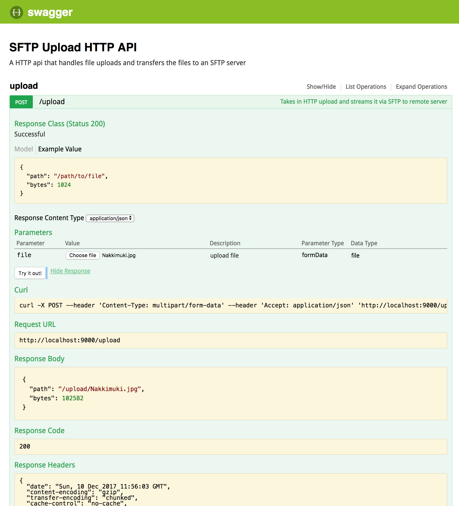

# SFTP Upload HTTP API

[](https://travis-ci.org/anttiviljami/sftp-upload-http-api)

A HTTP api that handles file uploads and transfers the files to an SFTP server

```bash
docker run \
  -d 9000:9000 \
  -e SFTP_HOST=sftp.someservice.com \
  -e SFTP_PORT=22 \
  -e SFTP_USER=sftpuser \
  -e SFTP_PASS=password \
  -e SFTP_UPLOAD_PATH=/upload \
  anttiviljami/sftp-upload-http-api
```

Your upload endpoint is `http://localhost:9000/upload`

Swagger UI available at `http://localhost:9000/documentation`

## Development

This repository includes a docker config for a Node.js environment + a dummy SFTP server

```bash
cp .env.sample .env # copy environment variables
npm install
docker-compose up web
```

Your API is now running in port `9000`, and your ssh server in port `2222`.

You can navigate to `http://localhost:9000/documentation` for Swagger UI



